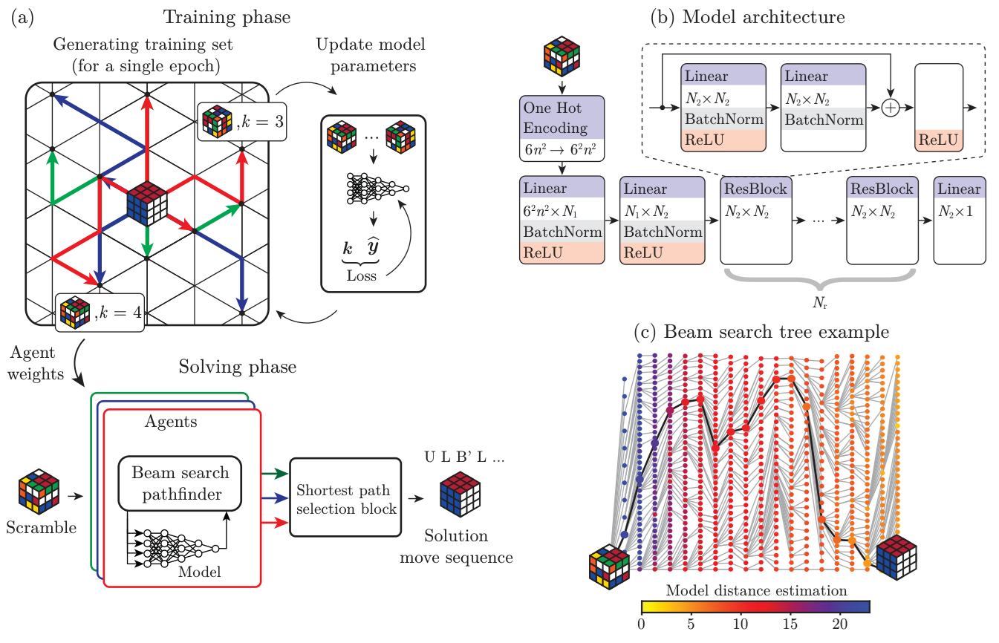

# A machine learning approach that beats Rubik’s cubes

[](#)
[](https://www.arxiv.org/pdf/2502.13266)

**Lightweight, end-to-end PyTorch pipeline** — data generation → training → search — all in `torch`, optimized for massive GPU parallelism. This repository implements a novel ML approach for finding short paths on large **Cayley graphs** (e.g. across permutation puzzles such as the Rubik’s Cube) by training neural networks to estimate diffusion distances and using those predictions to guide an efficient beam search. This approach is **zero human knowledge** (no handcrafted heuristics or domain rules).

<p align="center">
  
</p>

The same PyTorch pipeline works across distinct **Cayley graphs** without changing model architecture and hyperparameters. With one NVIDIA H100, model parameters (N₁ = 1024, N₂ = 256, Nᵣ = 1), beam width 2²⁰ and only 1.28×10⁸ training examples we achieve these results:

<p align="center">

| Puzzle            | Graph size        | Training (min) | Solving (min) | Avg. solution len. | Solved (%)     |
|:------------------|:------------------:|---------------:|--------------:|------------------:|---------------:|
| Rubik's Cube 3×3×3        | 4×10¹⁹            | 0.8            | 0.17          | 20.5 ± 0.1         | 100            |
| Rubik's Cube 4×4×4        | 7×10⁴⁵            | 1.5            | 1.24          | 65.0 ± 1.0         | 94             |
| Pancake Graph 55          | 3×10⁷³            | 1.4            | 3.49          | 50.0 ± 0.3         | 100            |
| Klotski 6×6 (PBC)         | 2×10⁴¹            | 1.2            | 0.45          | 113 ± 2.0          | 100            |

</p>

Using more computations the method reaches 98% optimality on 3×3×3 (QTM) and outperforms the top Santa Kaggle 2023 submissions on 3×3×3, 4×4×4 and 5×5×5 in average solution length. On 3×3×3, the batched GPU beam search delivers **20× faster** path finding than the previous state of the art at comparable solution lengths.


## Testing a Pre-trained Model

Run these commands to solve puzzles using preloaded model weights:

**Cube 3x3x3 (UQTM metric)**

```bash
python scripts/test.py --group_id 1 --target_id 0 --tests_num 3 --dataset santa --num_steps 100 --verbose 1 --epoch 8192 --model_id 333 --B 262144 --device_id 0
```

**Cube 4x4x4 (UQTM metric)**

```bash
python scripts/test.py --group_id 2 --target_id 0 --tests_num 3 --dataset santa --num_steps 150 --verbose 1 --epoch 8192 --model_id 444 --B 262144 --device_id 0
```

**Cube 5x5x5 (UQTM metric)**

```bash
python scripts/test.py --group_id 3 --target_id 0 --tests_num 3 --dataset santa --num_steps 200 --verbose 1 --epoch 8192 --model_id 555 --B 524288 --device_id 0
```

**Cube 3x3x3 (QTM metric)**

```bash
python scripts/test.py --group_id 54 --target_id 0 --tests_num 3 --dataset deepcubea --num_steps 100 --verbose 1 --epoch 8192 --model_id 333 --B 262144 --device_id 0
```

### Notes

* `tests_num` — sets an upper limit on the number of scrambles to test from the beginning of the dataset.
* `dataset` — selects the dataset to use:
  * `santa` — official Kaggle Santa 2023 dataset.
  * `rnd` — randomly generated dataset (100 scrambles) using 10,000(+1) random steps from the solved state.
  * `deepcubea` (1000 DeepCubeA scrambles), `deepcubeadifficult` (69 DeepCubeA subset scrambles), `deepcubeahard` (16 DeepCubeA subset scrambles) — available only for group `054` (3x3x3, QTM metric), useful for benchmarking against DeepCubeA and EfficientCube.
* `device_id` — specifies which GPU to use for testing (default is `0`). Useful when multiple GPUs are available.

Optimal solution lengths for the scrambles in the `deepcubeahard`: `[20, 20, 20, 21, 20, 20, 20, 20, 19, 20, 20, 19, 21, 20, 20, 20]`.

## Output

Test results saved in `logs/test_pXXX-tXXX-{dataset}_{model_id}_{epoch}_{B}.json`. Each file is a JSON array where `moves` contain generator indices used to reach the solved state for corresponding scramble.

## Training Your Model

Run training using your puzzle configuration:

```bash
python scripts/train.py --group_id <id> --target_id 0 --epochs <epochs> --hd1 <N_1> --hd2 <N_2> --nrd <N_r> --batch_size 10000 --K_max <K_max> --device_id 0
```

Example for 24-puzzle:

```bash
python scripts/train.py --group_id 28 --target_id 0 --epochs 16 --hd1 1024 --hd2 512 --nrd 1 --batch_size 10000 --K_max 100 --device_id 0
```

After training, use the assigned model_id (generated as int(time.time()) during training) to run beam search evaluation to use trained model:

```bash
python scripts/test.py --group_id 28 --target_id 0 --tests_num 3 --dataset rnd --num_steps 300 --num_attempts 1 --verbose 1 --epoch 16 --model_id {MODEL_ID} --B 65536 --device_id 0
```

Replace `{MODEL_ID}` with the actual numeric identifier saved in the logs.

## Adding New Puzzle Groups

To add your puzzle:

1. Define your puzzle moves in `generators` folder as `pXXX.json`.
2. Place a torch tensor `.pt` (1D tensor) in `targets`.
3. Add scrambles dataset (2D tensor, each row as a scramble) to `datasets` folder.

## Multi-Agent Evaluation

For **Cube 3x3x3 (QTM)** on the **`deepcubea`** dataset, a multi-agent script `scripts/traintest-multiagent.sh` automates:

* training multiple agents (`group_id=054`, `target_id=0`)
* testing each agent on the same scrambles
* aggregating results: per-agent and ensemble statistics

### What It Does

After training and testing `A` agents, the script calls `scripts/read-test-logs-multiagent.py` to compute:

* average solution length per agent
* ensemble stats (shortest solution per scramble)
* solved percentage
* move sequences from the best agent per scramble

### Output Example

```text
=== per agent ===
          tests  solved_%  avg_len
123456789   1000     97.3     21.4
123456790   1000     98.2     20.8

=== ensemble (shortest per scramble) ===
solved %           : 99.1
avg solution length: 19.95

=== moves (winning agent) ===
 test_num  solution_length   model_id            moves
        0                20  123456790  [2, 0, 4, 5, 1, ...]
        ...
```

All logs are saved in `logs/`, with results printed at the end.

## Available Groups and Kmax

| Group ID | Puzzle                        | Kmax used |
| -------- | ----------------------------- | --------- |
| 000      | Cube 2x2x2                    | 15        |
| 001      | Cube 3x3x3                    | 26        |
| 002      | Cube 4x4x4                    | 45        |
| 003      | Cube 5x5x5                    | 65        |
| 004      | Cube 6x6x6                    | 150       |
| 011      | Wreath 6/6                    | 10        |
| 012      | Wreath 7/7                    | 10        |
| 013      | Wreath 12/12                  | 20        |
| 014      | Wreath 21/21                  | 35        |
| 015      | Wreath 33/33                  | 75        |
| 017      | Globe 1/8                     | 60        |
| 018      | Globe 1/16                    | 110       |
| 019      | Globe 2/6                     | 25        |
| 020      | Globe 3/4                     | 40        |
| 021      | Globe 6/4                     | 40        |
| 022      | Globe 6/8                     | 165       |
| 023      | Globe 6/10                    | 170       |
| 024      | Globe 3/33                    | 500       |
| 025      | Globe 8/25                    | 700       |
| 026      | Puzzle 8                      | 30        |
| 027      | Puzzle 15                     | 80        |
| 028      | Puzzle 24                     | 150       |
| 029      | Puzzle 35                     | 200       |
| 030      | Puzzle 48                     | 250       |
| 031      | Puzzle 63                     | 300       |
| 034      | LRX 10                        | 50        |
| 035      | LRX 15                        | 100       |
| 036      | LRX 20                        | 200       |
| 037      | LRX 25                        | 300       |
| 044      | Pancake 10                    | 15        |
| 045      | Pancake 15                    | 25        |
| 046      | Pancake 20                    | 30        |
| 047      | Pancake 25                    | 40        |
| 048      | Pancake 30                    | 45        |
| 049      | Pancake 35                    | 55        |
| 050      | Pancake 40                    | 60        |
| 051      | Pancake 45                    | 65        |
| 052      | Pancake 50                    | 70        |
| 053      | Pancake 55                    | 75        |
| 054      | Cube 3x3x3 (DeepCubeA metric) | 26        |

For reproducing results from Table 4, refer to provided scripts `traintest-tab4-santa.sh` and `traintest-tab4-rnd.sh`, paper/solver-scrambles and paper/figure-scrambles contain generators and scrambles used in each specific experiment. The classical 15-puzzle (no wrap-around) is not a Cayley graph: node degrees vary with the blank position, hence the state graph is not vertex-transitive. We include it as a non-Cayley baseline at separate branch [puzzle-15](https://github.com/khoruzhii/cayleypy-cube/tree/puzzle-15).

## Citation

If you use this work in research, please cite one of the following BibTeX entries.

```bibtex
% Proceedings version (preferred once the NeurIPS paper is out)
@inproceedings{Chervov2025NeurIPSRubiks,
  author    = {Alexander Chervov and Kirill Khoruzhii and Nikita Bukhal and Jalal Naghiyev and Vladislav Zamkovoy and Ivan Koltsov and Lyudmila Cheldieva and Arsenii Sychev and Arsenii Lenin and Mark Obozov and Egor Urvanov and Alexey M. Romanov},
  title     = {A machine learning approach that beats Rubik’s cubes},
  booktitle = {Proceedings of the 39th Conference on Neural Information Processing Systems (NeurIPS 2025)},
  year      = {2025},
  note      = {Spotlight},
  url       = {https://neurips.cc/}
}
```

```bibtex
% arXiv preprint (use this if you are citing the preprint)
@misc{Chervov2025arXivRubiks,
  author        = {Alexander Chervov and Kirill Khoruzhii and Nikita Bukhal and Jalal Naghiyev and Vladislav Zamkovoy and Ivan Koltsov and Lyudmila Cheldieva and Arsenii Sychev and Arsenii Lenin and Mark Obozov and Egor Urvanov and Alexey M. Romanov},
  title         = {A Machine Learning Approach That Beats Large Rubik's Cubes},
  year          = {2025},
  eprint        = {2502.13266},
  archivePrefix = {arXiv},
  url           = {https://arxiv.org/abs/2502.13266}
}
```